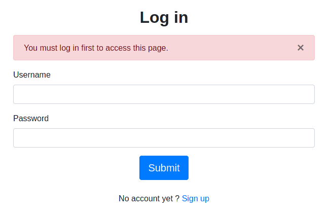

# STI - projet 2

Étudiants: Moïn DANAI, Laurent THOENY

## Table des matières

- [1 Introduction](#1-introduction)
- [2 Rappel technique](#2-Rappel-technique)
  - [2.1 Vulnérabilités](#2.1-Vulnérabilités)
  - [2.2 Exposition](#2.2-Exposition)
  - [2.3 Menaces](#2.3-Menaces)
  - [2.4 Risques et dommages](#2.4-Risques-et-dommages)
- [3 Description du système](#3-Description-du-système)
  - [3.1 Objectifs](#3.1-Objectifs)
  - [3.2 Exigeances](#3.2-Exigeances)
  - [3.3 Composition](#3.3-Composition)
- [4 Sources de menaces](#4-Sources-de-menaces)
  - [4.1 Sources d'attaques](#4.1-Sources-d'attaques)
  - [4.2 Cibles potentielles](#4.2-Cibles-potentielles)
  - [4.3 Motivations](#4.3-Motivations)
- [5 Scénarios d'attaque](#5-Scénarios-d'attaque)
  - [5.1 Déni de service](#5.1-Déni-de-service)
  - [5.2 Vol de données et sessions](#5.2-Vol-de-données-et-sessions)
  - [5.3 Usage de session à l'insu d'un utilisateur/admin (CSRF)](#5.3-Usage-de-session-à-l'insu-d'un-utilisateur/admin-(CSRF))
  - [5.4 Intrusion système / pivot (CORS)](#5.4-Intrusion-système-/-pivot-(CORS))
  - [5.5 Surveillance secrète (sniffing)](#5.5-Surveillance-secrète-(sniffing))
  - [5.6 Exécution de code côté client (XSS)](#5.6-Exécution-de-code-côté-client-(XSS))
  - [5.7 Usurpation d'identité et identité factice](#5.7-Usurpation-d'identité-et-identité-factice)
- [6 Correctifs proposés](#6-Correctifs-proposés)
- [7 Conclusion](#7-Conclusion)

## 1 Introduction

Le présent document a pour but de tracer en détails l'étude de menaces effectuée pour le [codebase](https://github.com/STI-Flask-FTW/sti-project-1) tiré du projet 1 de STI. Il s'agit de déterminer les menaces potentielles pour l'application donnée avec le contexte dans lequel elle est déployée, et y apporter des correctifs de sécurité dans la mesure du possible.

Les différents aspects sécuritaires abordés et étudiés sont individuellement chapitrés pour faciliter la navigation dans le contenu qui suit.

Enfin, une conclusion apporte des appréciations qualitatives sur le codebase de départ ainsi que la version amendée par les correctifs.

## 2 Rappel technique

Par souci de clarté, nous rappelons quelques définitions, termes, et concepts se rapportant à l'étude de menaces et la sécurité numérique en général.

Pour une entitée donnée, il peut exister des vulnérabilités sécuritaires qui pourraient être à découvert et donc potentiellement exploitées par une entité malveillante (ou plus) si elle le désire afin de réaliser un certain objectif, voire des cas de force majeure (actes de Dieu, ex. tremblement de terre) sans réel dessein néfaste.

### 2.1 Vulnérabilités

Dans le cadre de services numériques, les vulnérabilités sont généralement des failles logicielles, matérielles, ou structurelles dont la nature peut varier (ex. circuit défectueux, chiffrement faible, redondance inexistance).

Leur présence est souvent due à l'erreur humaine, qu'elle soit volontaire ou non. Dans certains cas, la malveillance mène à l'instauration de portes dérobées qui sont alors connues par une poignée de gens (qui en ont connaissance ou qui la découvrent par chance).

### 2.2 Exposition

Celles-ci se rapportent souvent à des services mis en réseau, et seraient donc exposés à Internet ou un réseau informatique qui y aura affaire d'une manière directe ou indirecte.

Les connexions entre réseaux et services numériques grandissant d'année en année, il devient difficile de mesurer la portée réelle quand on expose un certain service (et donc ses potentielles vulnérabilités). Il n'est pas trop optimiste de supposer qu'en pratique tout Internet peut atteindre les services les plus ouverts (i.e. utilisés par le grand nombre) tandis que ceux plus spécifiques comme des bases de données vivront sur des réseaux restreints.

### 2.3 Menaces

Internet et les services qu'il contient étant faits à l'image du monde réel, on y trouve de manière homologue toute une série d'acteurs malveillants avec des objectifs divers et variés. Certains convoitent l'argent et donc tenteront l'extorsion (ex. rançon), tandis que certaines agences gouvernementales seront plutôt intéressées par de la propriété intellectuelle et des informations de renseignements (_intelligence_) et opteront pour des infiltrations (comprendre: avec discrétion) de longue durée pour siphonner des données.

### 2.4 Risques et dommages

Le danger, ou risque, existe lorsqu'une menace peut exploiter des vulnérabilités dans son intérêt. Cela se fait généralement avec un type de dommage appelé conséquence.

On classe cela en trois catégories:

- Confidentialité (C),
- Intégrité (I),
- Disponibilité (D),

avec un facteur contextuel:

- direct - destruction de données, mise à l'arrêt de services,
- indirect - pertes financières, nuisances à l'image de marque,

que l'on mesurera en termes d'impact pour l'entité victime.

## 3 Description du système

### 3.1 Objectifs

La messagerie doit offrir les fonctionnalités suivantes:
- possibilité de créer un compte dans le service (contrôle d'accès),
  - contrôle d'accès avec un système de login username/password,
- possibilité de rédiger des messages avec champs: De, À, Message (messagerie),
- possibilité de modifier ses propres données,
- possibilité d'administrer les utilisateurs avec un compte admin (mot de passe, désactivation, rôle).

### 3.2 Exigeances

La messagerie doit illustrer les trois propriétés suivantes:
- Disponibilité: être accessible un maximum de temps,
- Fiabilité: ne pas perdre les données de ses utilisateurs,
- Confidentialité: garantir que les messages échangés entre deux utilisateurs ne sont accessibles par personne d'autre que l'administrateur et eux-mêmes.

### 3.3 Composition

On dénombre deux entités majeurs dans le système:
1. Comptes (normaux & admin),
2. Le couple webapp-database.

Leurs relations sont représentées comme suit:


## 4 Sources de menaces

### 4.1 Sources d'attaques

Nous pouvons supposer les différents acteurs malicieux suivants:
- utilisateur malintentionné,
- ennemi de l'entité où la messagerie est déployée (ex. concurrent),
- hacker "random" cherchant un gain (a priori monétaire),

### 4.2 Cibles potentielles

Naturellement, il suit que les entités suivantes sont à risques:
- n'importe quel utilisateur,
- un administrateur,
- les entités qui dépendent des propriétés sécuritaires fournies par l'application (ex. bouts de propriété intellectuelle dans un message -> entreprise).

### 4.3 Motivations

Selon les deux derniers chapitres, nous pouvons émettre les motivations suivantes:
- déni de service,
- accès à des informations privées,
- accès aux messages internes/privés,
- pivot pour une attaque de plus grande envergure.

## 5 Scénarios d'attaque

Nous considérons des attaques à l'encontre de l'application sous différents angles, notamment:

- Mapping the application
- Attacking authentication
- Attacking session management
- Attacking data stores
- Attacking users: Cross-site scripting
- Attacking the application server

et suivant les vecteurs d'attaque que nous avons trouvés:

- CSRF manquant dans tous les formulaires
- pas d'usage de CORS
- pas d'usage de X-Frame-Option

nous proposons les scénarios d'attaque ci-dessous.

### 5.1 Déni de service

L'application ne fournit aucune fonctionnalité de type "throttling", "quota management", et "robot check". Par conséquent, il est possible que:
- des créations de comptes en masse se fassent sans restriction,
- des messages soient envoyés sans fin, dans la limite de la taille des messages (200 caractères),
- des actions (ex. envoi de message, suppression de comptes) soient déclenchées par l'abus du manque de CSRF,
- des requêtes vers la boîte mail soient faites en masse et, supposant une quantité de messages importante, que la bande passante soit fortement sollicitée.

### 5.2 Vol de données et sessions

#### 5.2.1 Iframe

Comme nous pouvons inclure le site en Iframe sans restriction, il serait possible qu'un opérateur système malveillant monte un sous-domaine (i.e. avec le même eTLD+1) de sorte à ce que les cookies soient utilisables sur une page du sous-domaine qui inclut le domaine principal où réside le site (clickjacking).

Cette attaque est dangereuse car elle est facilement detectée par des outils de scanning utilisables par des attaquants sans grande connaissance, dans notre cas elle a été immédiatement detectée par _"Owasp ZAP"_ lors de notre analyse.

##### Applications contre notre site

Cette attaque permet à un site malveillant d'afficher un fragment de notre messagerie et de confondre cette dernière une autre action. La victime pense effectuer une action sur le site malveillant mais une action se produit en réalité sur notre messagerie. Plus d'informations disponibles [à cette adresse](https://portswigger.net/web-security/clickjacking).

Cette attaque diffère des attaques CSRF car elle demande une action utilisateur, pas uniquement de forger une requête qui sera executée par ce dernier.

##### Vérification de l'attaque

Afin de vérifier que cette attaque était possible, nous avons mis en ligne une page très simple qui avait pour but d'inclure notre messagerie dans une balise `<iframe>` depuis un autre dommage.


Nous pouvons ici constater que notre messagerie a été incluse, les attaques de ce type sont donc possibles.

##### Cause de l'attaque

L'en-tête `X-Frame-Options` n'est pas inclus dans les réponses du serveur web, conduisant à cette vulnérabilité. De plus, l'en-tête `Content-Security-Policy` qui est généralement utilisé de paire avec `X-Frame-Options` et permet de mitiger les attaques de ce type ainsi que les attaques XSS est également absent.

##### Mitigation de l'attaque

Les en-têtes correspondantes doivent être ajoutées, on utilisera `X-Frame-Options: deny` ainsi que `Content-Security-Policy: frame-ancestors 'self';` afin de s'assurer que cela ne soit plus une menace.

Dans notre cas, nous avons ajouté un hook python qui va ajouter des en-têtes à toutes les réponses.

```python
@APP.after_request
def add_headers(response):
    response.headers["X-Frame-Options"] = "DENY"
    response.headers["Content-Security-Policy"] = "frame-ancestors 'self';"
    return response
```

##### Vérification

Après cette modification, on peut réessayer l'inclusion.


Nous pouvons constater que l'inclusion de notre application n'est plus possible depuis un autre domaine.

Dans le cas où nous souhaitions rendre cela possible depuis un site partenaire, nous pouvons utiliser `X-Frame-Options: allow-from https://normal-website.com/`.

### 5.2.2 Logique applicative

Un attaquant exploite une faille dans la logique applicative afin de lancer une action qui lui est normalement interdite.

##### Applications contre notre site

Dans le cas de notre application, on citera principalement des problèmes d'autorisations qui permettraient à un utilisateur de lire les messages d'autres utilisateurs, il s'agit ici du plus gros risques pour la messagerie et la confiance des utilisateurs.

##### Vérification de l'attaque

On essaie d'accéder à `/message/id_message` depuis un autre utilisateur.

On constate que l'application n'autorise pas l'accès.


##### Mitigation des attaques

Vérifications sécuritaires durant les phases de développement. Il est important pour un développeur d'être créatif lorsqu'il imagine les possibles chemins d'accès pour un utilisateur et de vérifier ses vérifications d'accès en détails.

Dans notre cas, la condition qui permet de protéger un utilisateur contre l'accès à ses messages par un attaquant qui en connaît l'ID est vérifiée.

```python
elif message.recipient_name != user.username:
	flash("Can't view messages from other users", 'alert-danger')
    return redirect('/inbox')
```

### 5.2.3 Injections SQL

Ce type d'attaque consiste à utiliser des inputs utilisateurs afin de modifier le comportement d'une requête vers la base de données, dans le but de récupérer par exemple d'avantage de champs, d'autres informations que celles auxquelles on a accès, etc.

Un attaquant pourrait alors se renseigner sur la base de données et ses schémas, pour enfin en prendre un contrôle sous la forme de maniuplation de données dans les tables.

##### Applications contre notre site

Une injection SQL pourrait par exemple permettre à un attaquant de récupérer une liste des utilisateurs ou des messages confidentiels, risque important pour notre image si des données sensibles fuitent de cette manière.

##### Vérification de l'attaque

Il y a deux routes sur lesquelles des paramètres sont utilisés, il s'agit de `/user/username` et de `/message/message_id`.

Nous avons vérifiés les payloads classiques sur ces deux dernières, utilisé `sqlmap` (bien que ce dernier ne semble pas apprécier les paramètres sous cette forme) mais n'avons pas trouvé d'injection possible. En vérifiant le code et les technologies utilisées (SQLAlchemy principalement), ces dernières semblent ne pas être vulnérables aux injections SQL de premier ordre.

##### Mitigation des attaques

Utilisation d'un framework ou de requête préparées, vérification des entrées utilisateurs, escape des charactères à risques.

### 5.3 Usage de session à l'insu d'un utilisateur/admin (CSRF)

Tout comme l'attaque précédente, les attaques CSRF représentent un risque notamment par la facilité de détecter ces dernières (absence de jeton mitigateur dans les formulaires). Dans notre cas, l'utilisation encore une fois de _"Owasp ZAP"_ nous a signalé la chose rapidement.

##### Applications contre notre site

Des données sont transmises en `POST` dans plusieurs cas sur l'application, on peut détailler la liste des _"routes"_ concernées

* `/compose` - un attaquant peut usurper l'identité d'un utilisateur pour envoyer un message
* `/user/username` - un attaquant peut changer le mot de passe d'un utilisateur, le désactiver, ou le rendre administrateur. Il faut cependant que la victime possède les privilèges administrateurs pour accéder à cet URL.
* `/userAdd` - un attaquant peut créer un compte sur la messagerie si la victime possède les droits administrateurs.
* `/changePassword` - un attaquant peut changer le mot de passe de l'utilisateur
* `/login` - un attaquant peut .... se connecter légalement au site web s'il connaît les identifiants d'un utilisateur. Oui bon, intérêt limité par ici.
* `/signup` - un attaquant peut ... créer un compte comme depuis le formulaire d'inscription classique. Ici aussi l'intérêt semble limité.

Il semble donc que les modifications qu'un attaquant peut forcer un utilisateur à faire via CRSF sont graves, en particulier il peut se promovoir administrateur si la victime qui clique son lien est administrateur (ce qui lui donne plein pouvoirs) ou peut se faire passer pour un utilisateur s'il envoie des messages en son nom, ce qui peut être très grave.

##### Vérification de l'attaque

Afin de vérifier l'attaque, nous allons forger un URL permettant à un attaquant de forcer la victime à s'envoyer un message.

Le compte de notre victime est le compte administrateur par défault _admin_ et le compte utilisé par l'attaquant pour recevoir le message est `sicriss`. On imagine dans notre scénario d'attaque que la victime est un professeur de STI et que l'attaquant va s'envoyer un message qui lui indique que son cours est validé (un peu facile me direz-vous).

On créé une page HTML très basique avec un envoi de requête forgé

```html
<html>
  <body>
    <form action="http://localhost:5000/compose" method="POST">
      <input type="hidden" name="recipient" value="Sicriss" />
      <input type="hidden" name="title" value="Annonce" />
      <input type="hidden" name="body" value="Vous+avez+réussi+le+cours+de+STI+!" />
    </form>
    <script>
      document.forms[0].submit();
    </script>
  </body>
</html>
```

En vérifiant la chose depuis un accès sur le fichier HTML, nous sommes redirigés sur la page `/login`.



##### Pourquoi l'attaque n'a pas été possible de cette manière ?

L'attaque a été rendue impossible à cause des options spécifiées sur le cookie de session `SameSite : strict`.

La requête a été forgée correctement mais le cookie de session n'a pas été inclu dans cette dernière en raison de cette policy, ce qui a fait échouer notre tentative de CSRF.

Il serait possible à un attaquant de parvenir à lancer l'attaque s'il était sur le même domaine, cependant cela nous semble être très spécifique (si l'attaquant a déjà le contrôle sur le domaine, pas besoin de passer par une telle attaque).

Pour l'exercice nous avons procédé au test depuis un URL du même domaine (`localhost:81` vers `locahost:5000`) et obtenu cette fois-ci un résultat valide (voir ci-dessous).


##### Mitigation de l'attaque

L'attaque a été ici bloquée par l'attribut `SameSite` sur le cookie de session.

```python
res.set_cookie(
	key='auth',
    value=jwt_encode({'session': session_id, 'exp': expiry}),
    expires=expiry,
    samesite='Strict',)
```

Une autre méthode (plus classique) consiste à utiliser des tokens CSRF dans les requêtes concernées par la vulnérabilité ([détails](https://portswigger.net/web-security/csrf)) mais il semblerait que dans notre cas ce ne soit pas nécessaire, toutes les URLs concernées étant protegées par la session utilisateur.

### 5.4 Intrusion système / pivot (CORS)

Cross-origin resource sharing (CORS) est un mécanisme permettant l'inclusion de contenu et/ou ressources provenant d'un autre domaine, cela permet d'avantage de flexibilité que la "same-origin policy" mais peut être la source d'attaques et de vulnérabilités.

Le potentiel d'attaque vient du fait qu'un script tiers pourrait être utilisé à des fins complètement imprévisibles, et ce de manière homogène sur l'entièreté du site.

##### Applications contre notre site

Le cas "à risque" sur notre site est l'inclusion d'une librairie externe JavaScript (jQuery), nous faisons confiance dans notre cas au domaine _jquery.com_ et au fait que ce dernier ne sera pas compromis par un attaquant.

Nous n'allons pas aller dans les détails d'une attaque mais on peut notamment imaginer le cas où un attaquant effectue un MITM pour prétendre être le domaine ci-dessus, il pourra inclure un script malveillant chez la victime lorsque cette dernière fera la requête de ce dernier.

##### Mitigation des attaques

Une alternative serait d'utiliser jQuery en ayant téléchargé la ressource et en l'ajoutant au ressources statiques utilisées par le site, cela possède l'avantage d'inclure uniquement des sources du même domaine et d'éviter ainsi le risque que l'un des domaines auquel nous faisons appel ait été compromis ou soit utilisé pour un MITM.

Dans les deux cas, nous recommandons l'utilisation additionnelle de la notion de SRI (subresource integrity), une validation de l'intégrité des ressources demandées qui est maintenant répandue au niveau HTML. Cela permet de vérifier l'empreinte d'une ressource inclue et ainsi de s'assurer qu'elle n'a pas été alterée par un attaquant.

Au niveau du code, nous avons simplement remplacé notre inclusion par une vérifiant l'intégrité

```html
<script src="https://code.jquery.com/jquery-3.5.1.min.js"
		integrity="sha256-9/aliU8dGd2tb6OSsuzixeV4y/faTqgFtohetphbbj0="
		crossorigin="anonymous"> </script>
```

### 5.5 Surveillance secrète (sniffing)

Un autre avertissement au niveau des en-têtes signale l’absence de « X-Content-Type-Options » qui devrait être mis à « nosniff » afin d’éviter que le site soit accédé par d’anciennes versions de navigateur et que le contenu soit mal interprété à cause de « MIME-sniffing ». Il ne s'agit là pas d'une vulnérabilité importante en terme de sécurité mais d'une correction que nous incluons dans notre rapport puisqu'elle a été detectée durant notre phase de scanning de l'application.

##### Correction

Nous avons ajouté `response.headers["X-Content-Type-Options"] = "nosniff"` à la méthode de contrôle des en-têtes ajoutée précédemment.

### 5.6 Exécution de code côté client (XSS)

Cette attaque permet à un attaquant de faire exécuter du code malveillant (javascript) à une victime, généralement en se servant d'entrées utilisateurs mal vérifiées.

##### Applications contre notre site

Un attaquant pourrait utiliser son pseudonyme ou le contenu d'un message pour faire executer une balise `<script>` chez un administrateur et récupérer ainsi un cookie de Session lui permettant d'avoir un accès administrateur. Il pourrait aussi simplement voler des sessions utilisateurs de la même manière.

##### Vérification de l'attaque

La manière la plus simple pour vérifier cette attaque est d'envoyer des messages dans le but d'essayer de provoquer une alterte en JavaScript, indiquant que ce dernier est executé. Nous sommes partis de payloads simples tel que `<script> alert(1); </script>` et avons évolué vers des versions plus offusquées comme `¼script¾alert(¢XSS¢)¼/script¾` ou `&lt;META HTTP-EQUIV=\"refresh\" CONTENT=\"0;url=javascript&#058;alert('XSS');\"&gt;` en passant par des alternatives comme l'utilisation d'une ressource `</img>` mais aucun de ces payloads nous donna de résultats.


La raison pour laquelle l'attaque échoue est que le moteur de template pour l'affichage des pages web contient un système d'escaping de charactères, rendant une XSS classique impossible car le contenu des entrées utilisateurs ne sera jamais executé.

##### Mitigation des attaques

Vérification des entrées utilisateurs et/ou modification de ces dernières à l'affichage afin de ne pas inclure d'éléments de scripts ou d'HTML pouvant modifier le comportement désiré de la page.

Dans notre cas, c'est _Jinja_ qui a été utilisé durant le développement et permet l'auto-escaping, prevenant ainsi les risques de XSS ([Documentation](https://jinja.palletsprojects.com/en/master/api/#autoescaping)).

### 5.7 Usurpation d'identité et identité factice

Un attaquant vise à récupérer la session d'un utilisateur ou à se forger une session utilisateur afin d'obtenir un accès au site qu'il ne devrait pas posséder.

##### Applications contre notre site

Si un attaquant peut se créer une session alors il peut lire les messages de l'utilisateur qu'il va incarner, et il peut également promouvoir son compte en administrateur s'il le désire.

##### Vérification de l'attaque

On va ici chercher à analyser l'implémentation faite du cookie de session, qui utilise la technologie JWT afin de transmettre le nom de l'utilisateur à travers les pages. Tandis qu'une erreur d'implémentation peut rendre un token JWT mal sécurisé, une implémentation bien faite de la norme ne permet pas à un attaquant de modifier un cookie de session, ni d'en créer un. En effet, le jeton inclut une signature créée à l'aide d'un secret connu par l'application uniquement, et donc l'attaquant devrait récupérer ce secret s'il souhaite pouvoir forger un jeton. Bien entendu il est également nécessaire que les paramètres cryptographiques utilisés soient suffisamment robustes.

Ici, le JWT est correctement implémenté car différents outils spécialisés ne relèvent aucun problème quand à son usage ni son implémentation. De surcroît, le code applicatif ne révèle aucune faille majeure qui pourrait être exploitée.

##### Mitigation des attaques

Il faut être attentif aux erreurs d'implémentation et aux paramètres cryptographiques insufissants durant la phase de développement. Il est également nécessaire de faire attention aux potentielles attaques permettant de voler un cookie utilisateur, dans quel cas un jeton sécurisé ne sert à rien.

## 6 Correctifs proposés

Les correctifs proposés sont déjà détaillés dans le chapitre précédent. Toutefois, on peut les catégoriser ainsi:
- ajout de headers de sécurité,
- ajout de contrôles applicatiofs vis-à-vis des requêtes (nombre, origine, etc.),
- ajout de champs de sécurité dans les formulaires.

## 7 Conclusion

En somme, l'application est bien écrite dans son application métier mais manque de précisions sécuritaires quand on regarde de plus près. Les détails comme CORS, CSRF, et Iframe sont souvent utilisés comme leviers subtiles pour mener à bien une attaque sophistiquée qui pousse les failles jusqu'aux limites du tolérable.

L'adoption de BCP de la part du développeur permettrait de palier à ces problèmes, et ce également pour des futures applications écrites selon le même schéma.