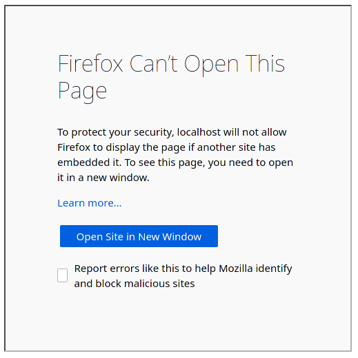

### "Clickjacking"

Cette attaque est dangereuse car elle est facilement detectée par des outils de scanning utilisables par des attaquants sans grande connaissance, dans notre cas elle a été immédiatement detectée par _"Owasp ZAP"_ lors de notre analyse.

Cette attaque permet à un site malveillant d'afficher un fragment de notre messagerie et de confondre cette dernière une autre action. La victime pense effectuer une action sur le site malveillant mais une action se produit en réalité sur notre messagerie. Plus d'informations disponibles [à cette adresse](https://portswigger.net/web-security/clickjacking).

##### Vérification de l'attaque

Afin de vérifier que cette attaque était possible, nous avons mis en ligne une page très simple qui avait pour but d'inclure notre messagerie dans une balise `<iframe>` depuis un autre dommage.


Nous pouvons ici constater que notre messagerie a été incluse, les attaques de ce type sont donc possibles.

##### Cause de l'attaque

L'en-tête `X-Frame-Options` n'est pas inclus dans les réponses du serveur web, conduisant à cette vulnérabilité. De plus, l'en-tête `Content-Security-Policy` qui est généralement utilisé de paire avec `X-Frame-Options` et permet de mitiger les attaques de ce type ainsi que les attaques XSS est également absent.

##### Mitigation de l'attaque

Les en-têtes correspondantes doivent être ajoutées, on utilisera `X-Frame-Options: deny` ainsi que `Content-Security-Policy: frame-ancestors 'self';` afin de s'assurer que cela ne soit plus une menace.

Dans notre cas, nous avons ajouté un hook python qui va ajouter des en-têtes à toutes les réponses.

```python
@APP.after_request
def add_headers(response):
    response.headers["X-Frame-Options"] = "DENY"
    response.headers["Content-Security-Policy"] = "frame-ancestors 'self';"
    return response
```

##### Vérification

Après cette modification, on peut réessayer l'inclusion.



Nous pouvons constater que l'inclusion de notre application n'est plus possible depuis un autre domaine.

Dans le cas où nous souhaitions rendre cela possible depuis un site partenaire, nous pouvons utiliser `X-Frame-Options: allow-from https://normal-website.com/`.