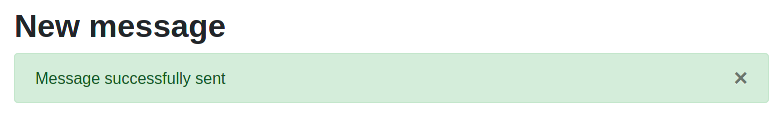

### "Clickjacking"

Cette attaque est dangereuse car elle est facilement detectée par des outils de scanning utilisables par des attaquants sans grande connaissance, dans notre cas elle a été immédiatement detectée par _"Owasp ZAP"_ lors de notre analyse.

##### Applications contre notre site

Cette attaque permet à un site malveillant d'afficher un fragment de notre messagerie et de confondre cette dernière une autre action. La victime pense effectuer une action sur le site malveillant mais une action se produit en réalité sur notre messagerie. Plus d'informations disponibles [à cette adresse](https://portswigger.net/web-security/clickjacking).

Cette attaque diffère des attaques CSRF car elle demande une action utilisateur, pas uniquement de forger une requête qui sera executée par ce dernier.

##### Vérification de l'attaque

Afin de vérifier que cette attaque était possible, nous avons mis en ligne une page très simple qui avait pour but d'inclure notre messagerie dans une balise `<iframe>` depuis un autre dommage.


Nous pouvons ici constater que notre messagerie a été incluse, les attaques de ce type sont donc possibles.

##### Cause de l'attaque

L'en-tête `X-Frame-Options` n'est pas inclus dans les réponses du serveur web, conduisant à cette vulnérabilité. De plus, l'en-tête `Content-Security-Policy` qui est généralement utilisé de paire avec `X-Frame-Options` et permet de mitiger les attaques de ce type ainsi que les attaques XSS est également absent.

##### Mitigation de l'attaque

Les en-têtes correspondantes doivent être ajoutées, on utilisera `X-Frame-Options: deny` ainsi que `Content-Security-Policy: frame-ancestors 'self';` afin de s'assurer que cela ne soit plus une menace.

Dans notre cas, nous avons ajouté un hook python qui va ajouter des en-têtes à toutes les réponses.

```python
@APP.after_request
def add_headers(response):
    response.headers["X-Frame-Options"] = "DENY"
    response.headers["Content-Security-Policy"] = "frame-ancestors 'self';"
    return response
```

##### Vérification

Après cette modification, on peut réessayer l'inclusion.


Nous pouvons constater que l'inclusion de notre application n'est plus possible depuis un autre domaine.

Dans le cas où nous souhaitions rendre cela possible depuis un site partenaire, nous pouvons utiliser `X-Frame-Options: allow-from https://normal-website.com/`.


### "CSRF" attacks

Tout comme l'attaque précédente, les attaques CSRF représentent un risque notamment par la facilité de détecter ces dernières (absence de jeton mitigateur dans les formulaires). Dans notre cas, l'utilisation encore une fois de _"Owasp ZAP"_ nous a signalé la chose rapidement.

##### Applications contre notre site

Des données sont transmises en `POST` dans plusieurs cas sur l'application, on peut détailler la liste des _"routes"_ concernées

* `/compose` - un attaquant peut usurper l'identité d'un utilisateur pour envoyer un message
* `/user/username` - un attaquant peut changer le mot de passe d'un utilisateur, le désactiver, ou le rendre administrateur. Il faut cependant que la victime possède les privilèges administrateurs pour accéder à cet URL.
* `/userAdd` - un attaquant peut créer un compte sur la messagerie si la victime possède les droits administrateurs.
* `/changePassword` - un attaquant peut changer le mot de passe de l'utilisateur
* `/login` - un attaquant peut .... se connecter légalement au site web s'il connaît les identifiants d'un utilisateur. Oui bon, intérêt limité par ici.
* `/signup` - un attaquant peut ... créer un compte comme depuis le formulaire d'inscription classique. Ici aussi l'intérêt semble limité.

Il semble donc que les modifications qu'un attaquant peut forcer un utilisateur à faire via CRSF sont graves, en particulier il peut se promovoir administrateur si la victime qui clique son lien est administrateur (ce qui lui donne plein pouvoirs) ou peut se faire passer pour un utilisateur s'il envoie des messages en son nom, ce qui peut être très grave.

##### Vérification de l'attaque

Afin de vérifier l'attaque, nous allons forger un URL permettant à un attaquant de forcer la victime à s'envoyer un message.

Le compte de notre victime est le compte administrateur par défault _admin_ et le compte utilisé par l'attaquant pour recevoir le message est `sicriss`. On imagine dans notre scénario d'attaque que la victime est un professeur de STI et que l'attaquant va s'envoyer un message qui lui indique que son cours est validé (un peu facile me direz-vous).

On créé une page HTML très basique avec un envoi de requête forgé

```html
<html>
  <body>
    <form action="http://localhost:5000/compose" method="POST">
      <input type="hidden" name="recipient" value="Sicriss" />
      <input type="hidden" name="title" value="Annonce" />
      <input type="hidden" name="body" value="Vous+avez+réussi+le+cours+de+STI+!" />
    </form>
    <script>
      document.forms[0].submit();
    </script>
  </body>
</html> 
```

En vérifiant la chose depuis un accès sur le fichier HTML, nous sommes redirigés sur la page `/login`.


##### Pourquoi l'attaque n'a pas été possible de cette manière ? 

L'attaque a été rendue impossible à cause des options spécifiées sur le cookie de session `SameSite : strict`.

La requête a été forgée correctement mais le cookie de session n'a pas été inclu dans cette dernière en raison de cette policy, ce qui a fait échouer notre tentative de CSRF.

Il serait possible à un attaquant de parvenir à lancer l'attaque s'il était sur le même domaine, cependant cela nous semble être très spécifique (si l'attaquant a déjà le contrôle sur le domaine, pas besoin de passer par une telle attaque).

Pour l'exercice nous avons procédé au test depuis un URL du même domaine (`localhost:81` vers `locahost:5000`) et obtenu cette fois-ci un résultat valide (voir ci-dessous).



##### Mitigation de l'attaque

L'attaque a été ici bloquée par l'attribut `SameSite` sur le cookie de session. 

```python
res.set_cookie(
	key='auth',
    value=jwt_encode({'session': session_id, 'exp': expiry}),
    expires=expiry,
    samesite='Strict',)
```

Une autre méthode (plus classique) consiste à utiliser des tokens CSRF dans les requêtes concernées par la vulnérabilité ([détails](https://portswigger.net/web-security/csrf)) mais il semblerait que dans notre cas ce ne soit pas nécessaire, toutes les URLs concernées étant protegées par la session utilisateur.


### Cross-Domain Source File Inclusion

Cross-origin resource sharing (CORS) est un mécanisme permettant l'inclusion de contenu et/ou ressources provenant d'un autre domaine, cela permet d'avantage de flexibilité que la "same-origin policy" mais peut être la source d'attaques et de vulnérabilités. 

##### Applications contre notre site

Le cas "à risque" sur notre site est l'inclusion d'une librairie externe JavaScript (jQuery), nous faisons confiance dans notre cas au domaine _jquery.com_ et au fait que ce dernier ne sera pas compromis par un attaquant.

Nous n'allons pas aller dans les détails d'une attaque mais on peut notamment imaginer le cas où un attaquant effectue un MITM pour prétendre être le domaine ci-dessus, il pourra inclure un script malveillant chez la victime lorsque cette dernière fera la requête de ce dernier.

##### Mitigation des attaques

Une alternative serait d'utiliser jQuery en ayant téléchargé la ressource et en l'ajoutant au ressources statiques utilisées par le site, cela possède l'avantage d'inclure uniquement des sources du même domaine et d'éviter ainsi le risque que l'un des domaines auquel nous faisons appel ait été compromis ou soit utilisé pour un MITM.

Dans les deux cas, nous recommandons l'utilisation additionnelle de la notion de SRI (subresource integrity), une validation de l'intégrité des ressources demandées qui est maintenant répandue au niveau HTML. Cela permet de vérifier l'empreinte d'une ressource inclue et ainsi de s'assurer qu'elle n'a pas été alterée par un attaquant.

Au niveau du code, nous avons simplement remplacé notre inclusion par une vérifiant l'intégrité

```html
<script src="https://code.jquery.com/jquery-3.5.1.min.js"
		integrity="sha256-9/aliU8dGd2tb6OSsuzixeV4y/faTqgFtohetphbbj0="
		crossorigin="anonymous"> </script>
```


### X-Content-Type-Options Header Missing

Un autre avertissement au niveau des en-têtes signale l’absence de « X-Content-Type-Options » qui devrait être mis à « nosniff » afin d’éviter que le site soit accédé par d’anciennes versions de navigateur et que le contenu soit mal interprété à cause de « MIME-sniffing ». Il ne s'agit là pas d'une vulnérabilité importante en terme de sécurité mais d'une correction que nous incluons dans notre rapport puisqu'elle a été detectée durant notre phase de scanning de l'application.

##### Correction

Nous avons ajouté `response.headers["X-Content-Type-Options"] = "nosniff"` à la méthode de contrôle des en-têtes ajoutée précédemment.


### Injections SQL

Ce type d'attaque consiste à utiliser des inputs utilisateurs afin de modifier le comportement d'une requête vers la base de données, dans le but de récupérer par exemple d'avantage de champs, d'autres informations que celles auxquelles on a accès, etc ...

##### Applications contre notre site

Une injection SQL pourrait par exemple permettre à un attaquant de récupérer une liste des utilisateurs ou des messages confidentiels, risque important pour notre image si des données sensibles fuitent de cette manière.

##### Vérification de l'attaque

Il y a deux routes sur lesquelles des paramètres sont utilisés, il s'agit de `/user/username` et de `/message/message_id`.

Nous avons vérifiés les payloads classiques sur ces deux dernières, utilisé `sqlmap` (bien que ce dernier ne semble pas apprécier les paramètres sous cette forme) mais n'avons pas trouvé d'injection possible. En vérifiant le code et les technologies utilisées (SQLAlchemy principalement), ces dernières semblent ne pas être vulnérables aux injections SQL.

##### Mitigation des attaques

Utilisation d'un framework ou de requête préparées, vérification des entrées utilisateurs, escape des charactères à risques.


### Logique applicative

Un attaquant exploite une faille dans la logique applicative afin de commettre un acte qui lui est normalement interdit.

##### Applications contre notre site

Dans le cas de notre application, on citera principalement des problèmes d'autorisations qui permettraient à un utilisateur de lire les messages d'autres utilisateurs, il s'agit ici du plus gros risques pour la messagerie et la confiance des utilisateurs.

##### Vérification de l'attaque

On essaie d'accéder à `/message/id_message` depuis un autre utilisateur.

On constate que l'application n'autorise pas l'accès.


##### Mitigation des attaques

Vérifications sécuritaires durant les phases de développement. Il est important pour un développeur d'être créatif lorsqu'il imagine les possibles chemins d'accès pour un utilisateur et de vérifier ses vérifications d'accès en détails.

Dans notre cas, la condition qui permet de protéger un utilisateur contre l'accès à ses messages par un attaquant qui en connaît l'ID est vérifiée.

```python
elif message.recipient_name != user.username:
	flash("Can't view messages from other users", 'alert-danger')
    return redirect('/inbox')
```

